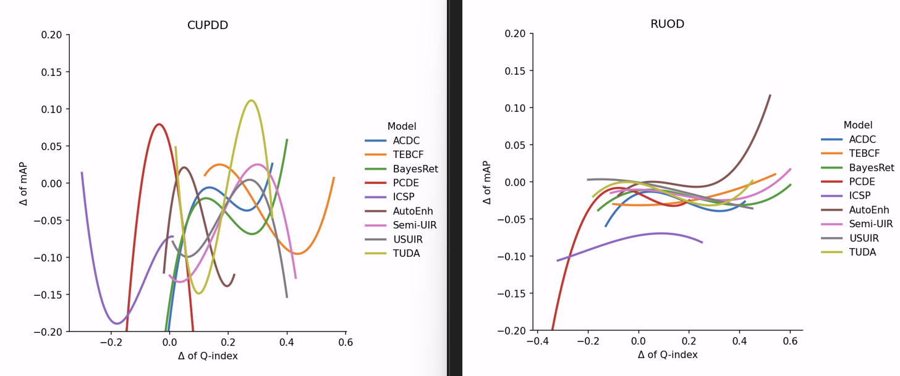
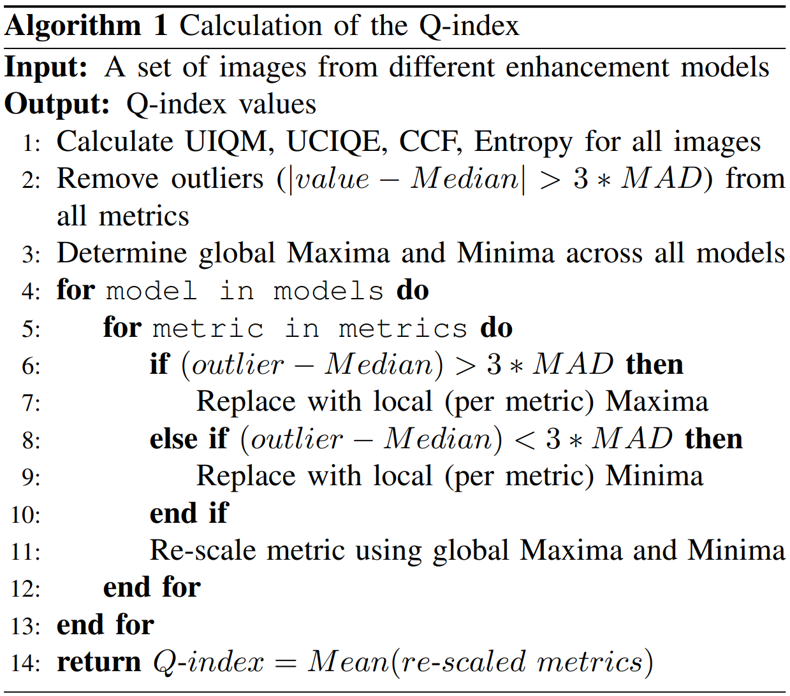
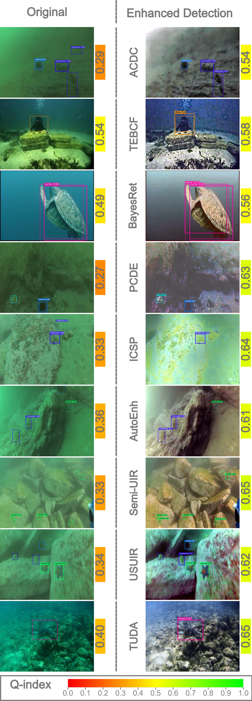

# Enhancement-Detection-Analysis
This repo contains an extensive evaluation of the effect of underwater image enhancement on object detection.

**Abstract:** Underwater imagery often suffers from severe degradation resulting in low visual quality and object detection performance. This work aims to evaluate state-of-the-art image enhancement models, investigate their impact on underwater object detection, and explore their potential to improve detection performance. To this end, we apply nine recent underwater image enhancement models, covering physical, non-physical and learning-based categories, to two recent underwater image datasets. Following this, we conduct qualitative and quantitative analyses on the original and enhanced images analyzing changes in the quality distribution of the images after enhancement. Next, we train three recent object detection models on the original images, after which the highest-performing detection algorithm is trained on the enhanced images. Subsequently, we compare the performance of the detection models trained on the original images with those trained on enhanced images. Furthermore, we perform a correlation study to examine the relationship between various enhancement metrics and the mean Average Precision (mAP). Finally, we conduct a thorough qualitative evaluation of the inference results from the trained detectors. In this work, we identify individual images where enhancement improved the detection performance despite an overall negative effect of enhancement on detection. The findings of this study offer insights for researchers to further investigate the effects of enhancement on detection at the individual image level rather than the dataset level. The data generated, codes used, and additional supplementary materials for this work are made publicly available on: https://github.com/RSSL-MTU/Enhancement-Detection-Analysis.

 Fig.1 Randomly selected Original images from each available quality bin of RUOD dataset. The corresponding Q-index values are color-mapped and placed under each image.

 Fig.1 Randomly selected Original images from each available quality bin of RUOD dataset. The corresponding Q-index values are color-mapped and placed under each image.

 Fig.1 Randomly selected Original images from each available quality bin of RUOD dataset. The corresponding Q-index values are color-mapped and placed under each image.

 Fig.1 Randomly selected Original images from each available quality bin of RUOD dataset. The corresponding Q-index values are color-mapped and placed under each image.

The code to calucalte the Quality Index (Q-index) using the some image enhancment metrics, outlier removal and global rescaling can be found in 'Q-index_final.m' MATLAB file.

Data links:
Enhanced versions of the CUPDD dataset using 9 underwater image enhancement algorithms:
https://drive.google.com/file/d/1yX86I6AM_Dqts5oevFtF7tSzImbU-mzz/view?usp=sharing

Enhanced versions of the RUOD dataset using 9 underwater image enhancement algorithms:
[https://drive.google.com/open?id=1-w-HB9AdblaEbr_1cP1sz59EFBgG6QM5&usp=drive_fs](https://drive.google.com/file/d/1wG7nW_5ol1w7SUJjKdfFsDw64qDa7RLn/view?usp=sharing)

Trained YOLO-NAS object detection models on the CUPDD dataset (1 on the original images + 9 using enhanced versions) (please use the SuperGrdainet implementation with the Large YOLO architecture):
https://drive.google.com/drive/folders/1jlwfmiuMJ_zIlTRDHhZRAARzekmSf7hS?usp=sharing

Trained YOLO-NAS object detection models on the RUOD dataset (1 on the original images + 9 using enhanced versions) (please use the SuperGrdainet implementation with the Large YOLO architecture):
[https://drive.google.com/file/d/1-wE2tpK9-Hx-L0aFYTjasN01bXKBm-ig/view?usp=drive_link](https://drive.google.com/drive/folders/12LFugM50L-r1wmVgZMvJrplAllEr7oTF?usp=sharing)

Notes:
- ALL images contain the inferred bounding boxes using the respective trained detection models and the ground truth annotations (dotted lines)
- For the first study, the original images are copied to each enhancement directory for easier comparison.

